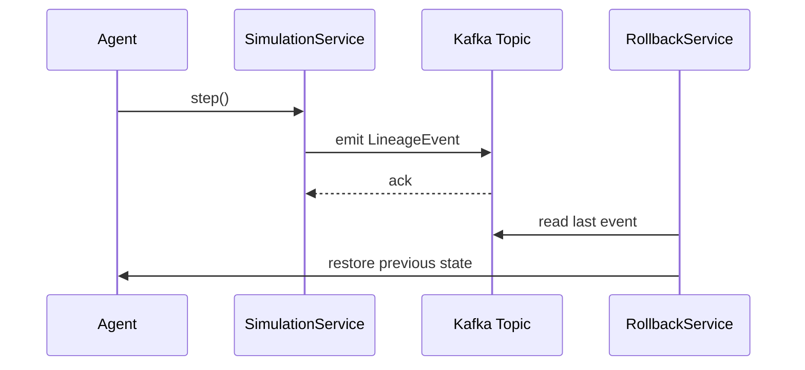

# ✅ **README.md（Full, Production-Ready, 2025 Flagship Version）**

`````markdown
# lineage-sim  
### Lineage-Aware, Rollback-Capable Digital Life Simulation Runtime  
A prototype by **Gavin Mai**  
License: Apache 2.0  

---

## 📌 1. Overview

`lineage-sim` is a prototype implementation of a **lineage-aware, rollback-capable digital life simulation runtime**.  
It demonstrates core mechanisms of the NIW-proposed project, including:

- A digital Agent with internal state  
- Behavior evolution via `step()`  
- Kafka-backed lineage event tracking  
- Safe rollback to previous states  
- Replay-driven reconstruction of system evolution  

The goal is to provide a transparent, auditable, and reversible computation model—  
a foundational requirement for AI Safety, distributed resilience, and emergent-behavior containment.

This prototype serves as both:  
**(1) A functional engineering demonstration**, and  
**(2) A technical exhibit in support of the National Interest Waiver (NIW) petition.**

---

## 📌 2. Architecture Diagram

````mermaid
flowchart TD
    A[Agent State] -->|step| B[Simulation Service]
    B -->|emit| C[Kafka Topic - lineage events]
    C --> D[Lineage Consumer]
    D --> E[State Store]
    E -->|rollback| F[Rollback Service]
    C -->|replay| G[Replay Service]
    G --> A
`````

---

## 📌 3. Key Components

### **3.1 Agent**

A minimal digital organism with:

* current state
* evolutionary rule
* lineage identifier

### **3.2 LineageEvent**

Immutable event representing:

* previous state
* new state
* lineageId
* timestamp

### **3.3 SimulationService**

* Runs `step()`
* Emits lineage events to Kafka

### **3.4 RollbackService**

* Reads last lineage event
* Restores previous agent state

### **3.5 ReplayService**

* Rebuilds agent evolution
* Enables auditability & reproducibility

---

## 📌 4. System Goals

### ✔ Reversibility

State changes must be restorable using lineage logs.

### ✔ Explainability

Every change produces a structured, timestamped event.

### ✔ Safety for Emergent Behavior

Rollback + replay provide safe boundaries for AI-like or evolutionary systems.

### ✔ Distributed Robustness

Kafka-based architecture decouples execution from persistence.

These goals align with U.S. national priorities stated in:

* **NIST AI Risk Management Framework**
* **NSF Safe Learning-Enabled Systems**
* **White House AI Safety Executive Order (2023)**
* **DOE Advanced Scientific Computing Research initiatives**

---

## 📌 5. Project Structure

```
prototype/
├── simulation-core/
│   ├── domain/
│   │   ├── Agent.java
│   │   ├── AgentState.java
│   │   ├── LineageEvent.java
│   ├── service/
│   │   ├── SimulationService.java
│   │   ├── RollbackService.java
│   │   ├── ReplayService.java
│   ├── controller/
│       ├── SimulationController.java
│
├── lineage-runtime/
│   ├── kafka/
│   │   ├── EventProducer.java
│   │   ├── EventConsumer.java
│   ├── model/
│       ├── LineageRecord.java
│
└── resources/
    ├── application.yml
```

---

## 📌 6. REST API Endpoints

| Method | Endpoint             | Description                            |
| ------ | -------------------- | -------------------------------------- |
| POST   | `/simulate/step`     | Perform one evolution step             |
| POST   | `/simulate/rollback` | Restore state backwards                |
| POST   | `/simulate/replay`   | Replay lineage history & rebuild state |

---

## 📌 7. Example Lineage Event

```json
{
  "lineageId": "agent-1",
  "previousState": 4,
  "newState": 7,
  "timestamp": "2025-01-25T12:22:31Z"
}
```

---

## 📌 8. How to Run

### **1. Start Kafka via Docker**

```bash
docker-compose up -d
```

### **2. Run the application**

```bash
mvn spring-boot:run
```

### **3. Test with curl**

```bash
curl -X POST http://localhost:8080/simulate/step
curl -X POST http://localhost:8080/simulate/rollback
curl -X POST http://localhost:8080/simulate/replay
```

---

## 📌 9. Sequence Diagram (System Interaction)



---

## 📌 10. NIW Alignment Summary (Exhibit Section)

This prototype demonstrates the feasibility and originality of a system that:

### **✔ Enables reversible, auditable computation**

Critical for AI safety, scientific reproducibility, and infrastructure resilience.

### **✔ Uses distributed event lineage as a safety boundary**

Matching NIST, NSF, DOE concerns around explainability and traceability.

### **✔ Provides early evidence of a multi-phase national-benefit project**

Showing engineering capability and alignment with federal technology priorities.

Thus, this repository serves as both an engineering artifact and an exhibit supporting the NIW petition.

---

## 📌 11. Future Roadmap (v0.2 → v1.0)

### **v0.2**

* Mutation operators
* Multiple agents
* Snapshotting system

### **v0.3**

* Safety boundaries for emergent behavior
* Deterministic replay engine

### **v1.0**

* Distributed simulation clusters
* Policy-driven rollback rules
* Visualization & web dashboard

---

## 📌 12. License

Apache License 2.0
© Your Name, 2025

---

## 📌 13. Contact

For collaboration requests:
**Gavin Mai**
Email: [gavinmai25@gmail.com]
GitHub: [https://github.com/Malasdisca/lineage-sim]
